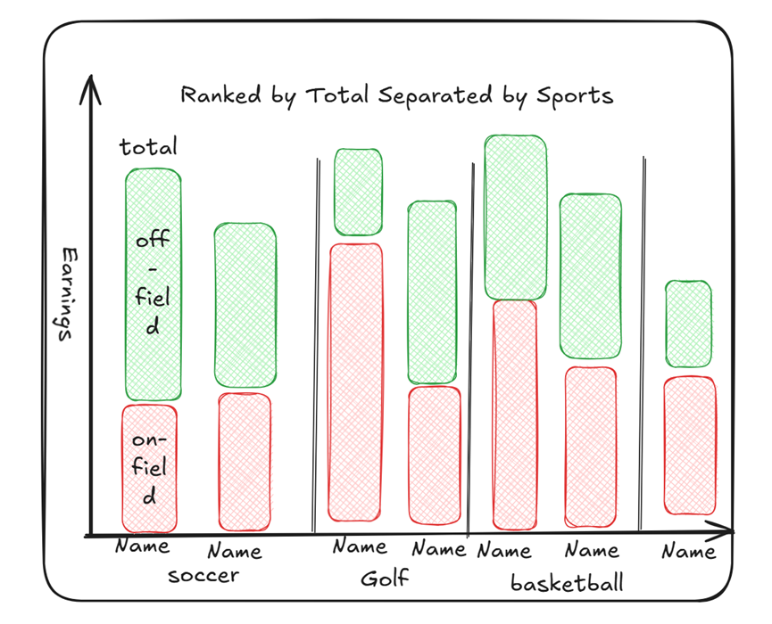

# The World's Top 50 Highest Paid Athletes
# Step 1:

litongwang Tableau
# Introduction to Visualization
This is a Forbes list of all types of athletes that visualizes the salary data of all athletes. We compare salaries online and offline.

Here is a link to our raw data: https://data.world/makeovermonday/the-worlds-highest-paid-athletes-in-2023
# What we did
We have used bar charts to visualize this data and we have tried to show the athletes on-field salary and off-field salary in two bar charts respectively. Additionally, we used color to show the difference in total salaries, with the higher salary bar being darker in color and vice versa.

# Detailed Step 1
We downloaded the xlsx version of the original data from the dataset link.
# Detailed Step 2
We cleaned the dataset and we numericized the payroll fields in the dataset to ensure that the data would display properly when imported into Tableau.
# Detailed Step 3
Create a bar chart. Use two bar charts to represent the salary levels of the athletes on and off the field.
# Detailed Step 4
Use colors to visualize the total salary.

# Step 2:

Source Website:https://www.forbes.com/lists/athletes/?sh=69bf004f5b7e

Using Stephen Few's Data Visualization Effectiveness Profile to critique the selected visualization:

1. **Usefulness**
    
    I rated this aspect quite low (2) because the visualization does not provide significant value in terms of insights. While it conveys some data, it fails to offer more depth or inspire meaningful conclusions. Visualization should go beyond just showing numbers; it should help the audience extract more actionable insights.
    
2. **Completeness**
    
    The completeness of the data is solid (rated at 10), as it includes all the relevant information required for understanding the topic. The data coverage is broad, but the representation doesn’t aid much in improving comprehension.
    
3. perceptiveness
    
    The perceptiveness of the visualization struggles (rated around 2). The visualization type is not suitable for easy comprehension, and it requires significant effort from the audience to interpret the data correctly. 
    
4. **Truthfulness**
    
    On a positive note, the accuracy of the data (rated 10) is commendable. The numbers valid and reliable. 
    
5. **Intuitiveness**
    
    The chart is moderately intuitive (rated 10). Once the user understands the structure, it becomes relatively easy to interpret 
    
6. **Aesthetics**
    
    From an aesthetic point of view (rated around 2), the visualization does not appeal to the viewer. It’s quite basic and does not provide a visually pleasant experience. There’s a lot of room for improvement in the design, layout, and color schemes to make the visualization more engaging.
    
7. **Engagement**
    
    Lastly, the engagement level (rated around 2) is low. The visualization does not draw the audience into the data or inspire them to explore deeper insights. It feels static and passive, which does not encourage further interaction with the information.
    

---

### Final Evaluation Using Stephen Few's Criteria

This method was highly effective in sparking new ideas for redesigning the visualization. It provided a comprehensive framework that helped me reflect deeply on each aspect of the visualization, allowing me to identify where improvements were most needed.

The evaluation process brought my attention to areas that I might not have considered before, such as perceptiveness and **engagement**. These are crucial elements that will now play a central role in my redesign. The feedback guided me toward improving the visual hierarchy, adjusting chart types, and optimizing the layout to help the audience understand the data more intuitively.

Furthermore, Stephen Few's method helped me look beyond the surface and think strategically about **how** the data is presented, rather than just **what** is presented. This clarity is invaluable when aiming for a more polished and effective data visualization.

# Step 3:

> [https://excalidraw.com/#json=8PnX_OSwl2gAS1iVsEnEp,jAmcjh8sZqPdOCBoVcC48Q](https://excalidraw.com/#json=8PnX_OSwl2gAS1iVsEnEp,jAmcjh8sZqPdOCBoVcC48Q)
> 

# Step 4:

### Interview Questions:

1. Can you tell me what you think this is?
2. Can you describe to me what this is telling you?
3. Is there anything you find surprising or confusing?
4. Who do you think is the intended audience for this?
5. Is there anything you would change or do differently?

### Feedback from Participants:

### Participant 1:

- **Profile**: Student, mid-20s
- **Response**:
    1. "This looks like a comparison of earnings for different athletes across sports."
    2. "It shows how much athletes make from their on-field and off-field activities."
    3. "It’s a bit unclear at first what the colors represent. Maybe it could be explained better in a legend."
    4. "Probably for sports analysts or fans who are interested in athlete earnings."
    5. "Adding a clearer label or legend for the red and green areas would help."

### Participant 2:

- **Profile**: Adult, early 30s
- **Response**:
    1. "This seems like a ranking of athletes’ earnings by sport, with off-field and on-field revenue separated."
    2. "It compares total earnings by showing the distinction between off-field and on-field income."
    3. "I'm not sure if the height of the bars is representative of the same scale across different sports. It might be good to clarify that."
    4. "This could be for sports management or people studying athlete compensation."
    5. "A clearer axis label and maybe a breakdown of which athletes are being represented could improve it."

### Participant 3:

- **Profile**: Adult, late 50s
- **Response**:
    1. "It seems like a graph comparing how much athletes earn in different sports."
    2. "It separates earnings into on-field and off-field earnings for various sports."
    3. "I was confused at first by the vertical text on the bars. It’s hard to read."
    4. "I think this would be interesting to people who follow sports or work in the industry."
    5. "Making the text easier to read, especially on the bars, would be a big improvement."

### Patterns in Feedback:

- **Clarity**: All participants found the general idea of the visualization understandable, but there was some confusion around the specifics of the bar colors and labeling. Two participants mentioned the need for a clearer legend or labeling of red/green bars.
- **Design Suggestions**: Common suggestions included improving the clarity of the axis labels and making the vertical text on the bars more readable.
- **Audience**: The intended audience was identified as people interested in sports earnings, including fans and professionals in the sports industry.

### Redesign Suggestions Based on Feedback:

- **Add a Legend**: Clarify the meaning of red and green bars with a small legend indicating what on-field and off-field earnings represent.
- **Adjust Text Orientation**: Improve the readability of vertical text on the bars. Either change the orientation or provide clearer labeling on the axes.
- **Clarify Scales**: Ensure that the bar height is consistently scaled across sports, or include notes if there are differences in scale.

This feedback will help refine the design in Step 5.

# Step 5

### Interpretation of the Graph:

The chart has been modified based on feedback from Step 4, changing the bar chart into a horizontal bar chart.

The chart is categorized by sport and athlete, with total earnings used to rank each sport.

To distinguish between Off-the-Field Earnings and On-the-Field Earnings, a dividing line has been used within the bars.

This visualization easily showcases which sport has the highest total earnings and which athlete earns the most.

Additionally, it reveals that in some sports, wealth is concentrated among a few athletes, while in others, a majority of athletes enjoy relatively high earnings.

Compared to the original visual chart, this version has significantly improved in terms of comprehensibility, ease of use, audience suitability, and data accuracy.
